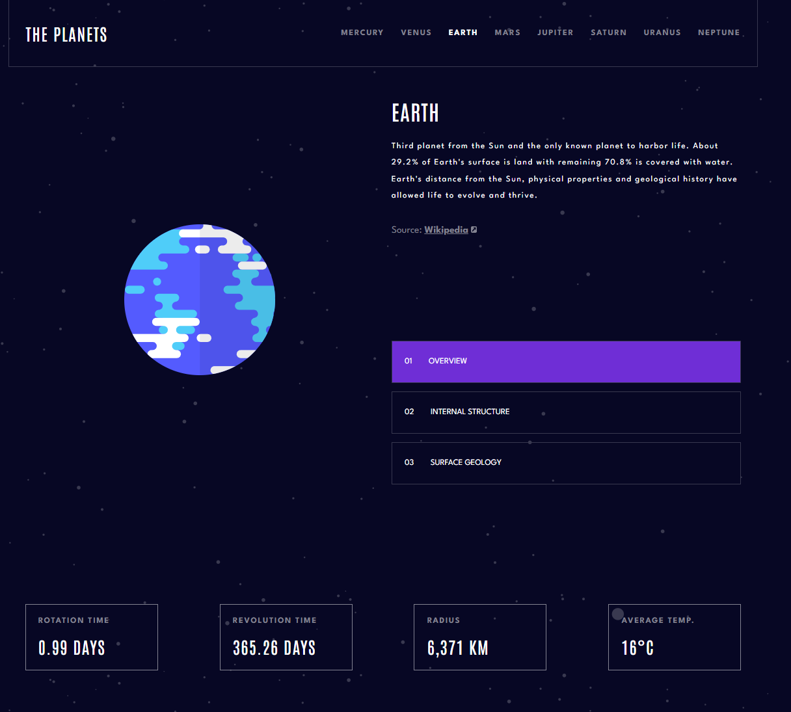
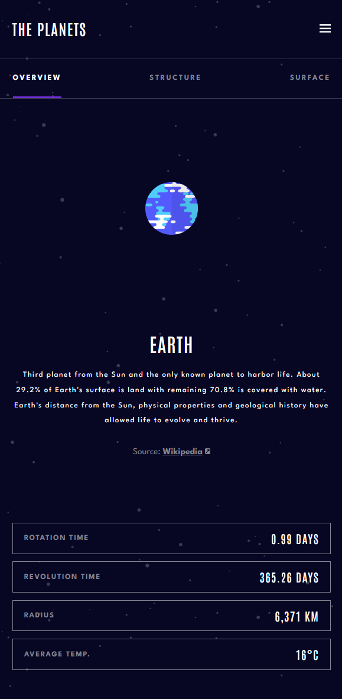

# Frontend Mentor - Planets fact site solution

This is a solution to the [Planets fact site challenge on Frontend Mentor](https://www.frontendmentor.io/challenges/planets-fact-site-gazqN8w_f). Frontend Mentor challenges help you improve your coding skills by building realistic projects. 

## Table of contents

- [Overview](#overview)
  - [The challenge](#the-challenge)
  - [Screenshot](#screenshot)
  - [Links](#links)
- [My process](#my-process)
  - [Built with](#built-with)
  - [What I learned](#what-i-learned)
  - [Useful resources](#useful-resources)
- [Author](#author)

**Note: Delete this note and update the table of contents based on what sections you keep.**

## Overview

### The challenge

Users should be able to:

- View the optimal layout for the app depending on their device's screen size
- See hover states for all interactive elements on the page
- View each planet page and toggle between "Overview", "Internal Structure", and "Surface Geology"

### Screenshot
# Desktop


# Mobile


### Links

- [Solution URL]([https://your-solution-url.com](https://www.frontendmentor.io/solutions/planets-facts-page-in-vanilla-js-lyCj55VYfW))
- [Live Site URL](https://your-live-site-url.com)

## My process

### Built with

- Semantic HTML5 markup
- CSS custom properties
- Flexbox
- CSS Grid
- Mobile-first workflow

### Thoughts

Wow! this project was very complex, since i did it only with Vanilla JS. I know that if I did it with React Js I would have done it much faster, but I wanted to do the challenge of doing it only with Vanilla Js. I also started doing it with SCSS but when I had to change the colors by planet there is no way to edit the SCSS from Js, so I had to remove it and work with the variables directly in CSS.

If you know of a way to edit variables in SCSS from JavaScript I'm all ears! Thank you!


```css
:root{
  --planet-color : #419EBB;
}
```
```js
const rootCss = document.querySelector(":root")
rootCss.style.setProperty('--planet-color', planetSelectedInfo[0].color)
}
```

### Useful resources

- [CSS Change Variables With JavaScript](https://www.w3schools.com/css/css3_variables_javascript.asp) 

## Author

- Github - [Ricardo Halmoguera](https://github.com/RickHalmoguera)
- Frontend Mentor - [@RickHalmoguera](https://www.frontendmentor.io/profile/RickHalmoguera)
